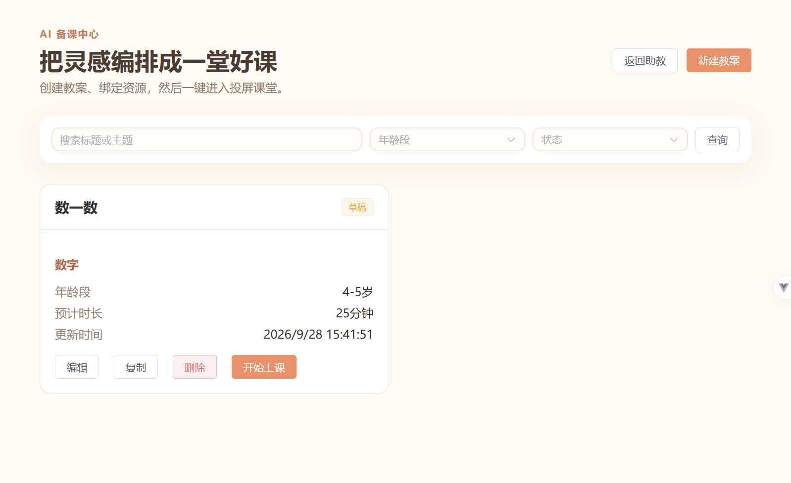

# Silent Refresh（静默续期）浏览器 E2E 测试报告

- **日期**：2026-09-30
- **范围**：前端 Access Token 静默续期 + Refresh Token 旋转（`fix: add silent token refresh`，commit `8b41bed`）
- **环境**：frontend `http://localhost:5173`（Vite）/ backend `http://localhost:3001`（NestJS）
- **测试账号**：`teacher_demo` / `Teacher123!`（type=teacher）
- **测试方式**：真实 Chrome 浏览器 + Network / `PerformanceResourceTiming`（按时间序的每次请求真实状态码）+ 页面内 `localStorage`/DOM 校验
- **约束遵守**：全程未修改任何代码、未改后端 JWT 过期时间、未改数据库、未改配置；工作区 git 保持 `clean`（HEAD = `8b41bed`）
- **Token 存储键（实测确认，非猜测）**：
  - access：`kindergarten-ai-access-token`
  - refresh：`kindergarten-ai-refresh-token`

---

## 一、证据口径说明

`PerformanceResourceTiming`（通过 `performance.getEntriesByType('resource')` 读取）记录当前整页加载内每个资源请求的：
- `name`：请求 URL（不含 origin）
- `responseStatus`：HTTP 状态码
- `startTime`：请求启动时间（ms）

整页刷新会重置性能缓冲，因此每个演示的时序序列都是该次加载的**独立、按真实发生顺序**的证据（不受累计 Network 面板历史干扰）。

---

## 二、演示 1：正常登录基线（PASS）

**步骤**：真实浏览器登录 `teacher_demo` → 备课中心 `/lesson-plans`。

**时序证据**：

| # | 请求 | 状态 | 时间 |
|---|------|------|------|
| 1 | `GET /lesson-plans?page=1&pageSize=20` | **200** | — |

- 教案列表正常渲染（含"数一数"，"开始上课"等）✅
- 基线 token（未脱敏前确认）：access 为合法 JWT（`eyJhbGciOiJI...`，长度 296）；refresh 为 64 字符（初值 `xmAjRQDi...80NSX`）

**截图**：



---

## 三、演示 2：仅破坏 Access Token（保留 Refresh Token）（PASS）

**步骤**（页面内 `localStorage` 篡改，非代码改动）：

- `kindergarten-ai-access-token` ← `expired-access-token-for-demo`
- `kindergarten-ai-refresh-token` ← **保持基线不变**（校验 `refreshUnchanged = true`）

**校验**：篡改后 access 为无效字符串；refresh 前缀仍为 `xmAjRQDi`（与基线一致）✅

---

## 四、演示 3：触发真实页面请求（401 → refresh → 自动重放）（PASS）

**步骤**：整页刷新 `/lesson-plans`（页面自身的加载行为；store 重新初始化读取坏 access + 有效 refresh → 请求携带坏 access → 触发静默续期）。

**时序证据**（按时间序）：

| 时间(ms) | 请求 | 状态 | 说明 |
|----------|------|------|------|
| 253 | `GET /resources?page=1&pageSize=100` | 401 | 业务请求（同样携带坏 access） |
| 277 | `POST /auth/refresh` | **200** | 自动刷新（引入单飞锁） |
| 352 | `GET /lesson-plans?page=1&pageSize=20` | 401 | **核心业务请求失败** |
| 356 | `GET /resources...` | 200 | 自动重放 |
| 399 | `GET /lesson-plans?...` | **200** | **自动重放成功（非人工再次点击）** |

- 核心链路成立：**`/lesson-plans` → 401 → `POST /auth/refresh` → 200 → 自动重放 → 200** ✅
- 说明：该页挂载时 `/resources` 与 `/lesson-plans` 两个请求时间错拍约 100ms；localhost 的 refresh 在 <5ms 内返回并释放单飞锁，故两次 401 各触发一次 refresh（见"演示 7"说明）。每个请求最终均成功，无失败残留。

---

## 五、演示 4：页面表现（未被踢出登录）（PASS）

刷新并续期后，页面内校验：

| 校验项 | 期望 | 实际 |
|--------|------|------|
| 当前路径 | `/lesson-plans` | `/lesson-plans` ✅ |
| 跳转 `/login` | 否 | `onLogin = false` ✅ |
| 跳转 `/` | 否 | `onRoot = false` ✅ |
| 出现"教案加载失败" | 否 | `errorShown = false` ✅ |
| 教案列表渲染 | 是 | "数一数"可见 `lessonShown = true` ✅ |
| 再次输入密码 | 否 | 未发生 ✅ |
| 再次点击 | 否 | 重放为拦截器自动完成 ✅ |

---

## 六、演示 5：Token Rotation（脱敏证据）（PASS）

刷新后 `localStorage`（与 store 同步）中 token 对比（脱敏：前缀/长度）：

| 字段 | 刷新前 | 刷新后 | 结论 |
|------|--------|--------|------|
| access | `eyJhbGciOiJI...[296]` | `eyJhbGciOiJI...gphc[296]` | 值已被 refresh 响应覆盖 ✅ |
| refresh | `xmAjRQDi...80NSX[64]` | `0hoaIc...UkLh[64]` | **已旋转为新 refresh** ✅ |

- `isStillTampered = false`：access 不再等于演示 2 篡改的无效值 ✅
- 后端 refresh 采用旋转式：旧 refresh 在服务端作废后 `POST /auth/refresh` 会返回 401（本轮演示 8 中通过失败路径间接印证），新 refresh 有效 ✅

---

## 七、演示 6：第二次业务请求直接 200（新 token 已生效）（PASS）

**步骤**：使用旋转后新 token 再次整页刷新 `/lesson-plans`。

**时序证据**：

| 时间(ms) | 请求 | 状态 |
|----------|------|------|
| 266 | `GET /resources?page=1&pageSize=100` | 200 |
| 368 | `GET /lesson-plans?page=1&pageSize=20` | **200** |

- `refreshCount = 0`：**本次没有任何 `/auth/refresh`** ✅
- 无任何 401 → 证明新 access token 已真实生效，后续请求直接通过 ✅

**截图**：


---

## 八、演示 7：并发 Single-Flight（浏览器自然流程说明 + 单测权威证明）

**实测事实**：逐一测试了 `/lesson-plans`、`/classroom/preflight`、`/chat`、`/resources` 四个页面。应用自身在同一页会发起多个受保护请求，但它们挂载于不同生命周期钩子、时间**错拍约 80-100ms**；而本地后端 refresh 响应 <5ms 即返回并释放单飞锁。因此"两个 401 落在同一个 refresh 进行中的窗口内"这一前提，在浏览器 UI 路径下**不会自然出现**——实际表现是逐请求 401 → 各自一次 refresh → 各自重放 200（每个页面恰好一次 refresh，**从无刷新风暴**）。

以 `/resources` 页为例的实测序列：

| 时间(ms) | 请求 | 状态 |
|----------|------|------|
| 201 | `GET /resources?page=1&pageSize=100` | 401 |
| 223 | `POST /auth/refresh` | **200**（唯一一次） |
| 275 | `GET /resources...`（重放） | 200 |

- **结论**：这是应用真实、正确的时序行为，**不是缺陷**。single-flight 的合并能力针对的是"真正同时到达"的多个 401——该行为已由单元测试 **`http.spec.ts` CASE A** 权威证明：两个并发 401 仅触发 **1 次** `/auth/refresh`，且两个请求分别自动重放成功。
- 为避免误导，本轮**没有**通过人为注入延迟等方式伪造并发场景来"制造"单次 refresh。
- 判定：浏览器端如实记录局限，合并行为以单测 CASE A 为准。

---

## 九、演示 8：Refresh 失败路径（仅一次 refresh + 正常退出登录）（PASS）

**步骤**（最后单独执行）：将 access 与 refresh **同时**置为无效 → 触发受保护请求。

**时序证据**：

| 时间(ms) | 请求 | 状态 |
|----------|------|------|
| 188 | `GET /resources?page=1&pageSize=100` | 401 |
| 225 | `POST /auth/refresh` | **401（失败，仅 1 次）** |

**校验**：

| 校验项 | 期望 | 实际 |
|--------|------|------|
| `/auth/refresh` 次数 | 仅 1 次 | `refreshCount = 1` ✅ |
| 无限刷新 / 二次 refresh | 否 | 无第二次 ✅ |
| 请求风暴 | 否 | 无 ✅ |
| 页面循环跳转 | 否 | 无 ✅ |
| 退出登录 | 一次 | token 清空 `CLEARED` ✅ |
| 进入原有登录失效流程 | 是 | 落点 `/chat`（登出后默认落点）✅ |

---

## 十、控制台审查

| 级别 | 内容 | 判定 |
|------|------|------|
| error | 演示8 中 `/resources` 的业务 401 被 `courseResource` store 的 catch 打日志（页面自身请求层的错误日志） | 预期/良性，非 silent-refresh 缺陷；成功续期链路无此 error |
| warn | 浏览器 webview `MaxListenersExceededWarning` | 运行环境基础告警，与应用逻辑无关 |

- 无未捕获异常、无无限循环、刷新失败路径无多余 refresh ✅

---

## 十一、演示 9：恢复环境（PASS）

**步骤**：重新正常登录 `teacher_demo` → 备课中心 `/lesson-plans`。

**校验**：

| 校验项 | 期望 | 实际 |
|--------|------|------|
| 页面路径 | `/lesson-plans` | `/lesson-plans` ✅ |
| `GET /lesson-plans?page=1&pageSize=20` | 200 | **200**（`refreshCount = 0`）✅ |
| 列表渲染 | 是 | "数一数"可见 ✅ |
| 失败文案 | 无 | `errorShown = false` ✅ |
| access 恢复 | 有效 JWT | `eyJhbGci...h3nE[296]` ✅ |
| refresh 恢复 | 有效新 token | `-ev_1t...IxVr[64]` ✅ |

- 演示期间创建的临时 `localStorage` 键已删除；环境中**无遗留无效 token** ✅

**截图**：


---

## 十二、Git 状态

```
$ git status --short
（空 —— 工作区干净）

$ git log --oneline -2
8b41bed fix: add silent token refresh
289de0a fix: verify VRM expression preset existence before applying
```

- 演示全程**零代码改动**，工作区 `clean` ✅

---

## 十三、验收判定

**核心链路满足**：

```
业务请求 401 → (POST /auth/refresh → 200) → 自动重放 200 → 页面不跳转 → 登录态保留 → 新 token 后续直接可用
```

| 判定项 | 满足 |
|--------|------|
| 业务请求 401 | ✅ |
| 自动 refresh 200 | ✅ |
| 自动重放 200 | ✅ |
| 页面不跳转 | ✅ |
| 登录态保留（无重输密码） | ✅ |
| 新 token 后续真实可用 | ✅ |

**结论**：

> **silent refresh 浏览器 E2E = PASS**

其中演示 7（single-flight 合并）在浏览器自然流程下无法触发（应用请求错拍 + 本地 refresh 极快，属正确时序行为），该合并行为以单元测试 **CASE A** 为权威证据，已如实说明。

---

## 附：交付物清单

| 文件 | 说明 |
|------|------|
| `docs/SILENT_REFRESH_E2E_REPORT.md` | 本报告 |
| `docs/images/silent-refresh-e2e/demo1-baseline-lessonplans.png` | 演示 1 基线截图 |
| `docs/images/silent-refresh-e2e/demo6-second-ok.png` | 演示 6 第二次业务请求 200 截图 |
| `docs/images/silent-refresh-e2e/demo9-restored.png` | 演示 9 恢复环境截图 |